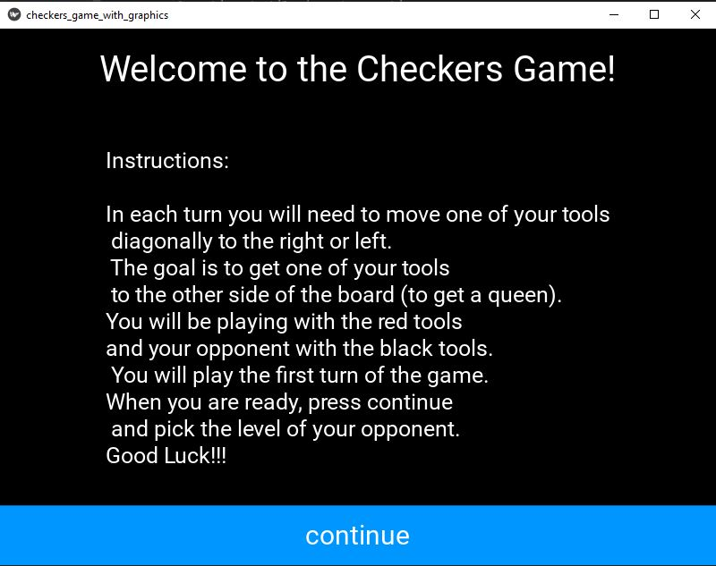
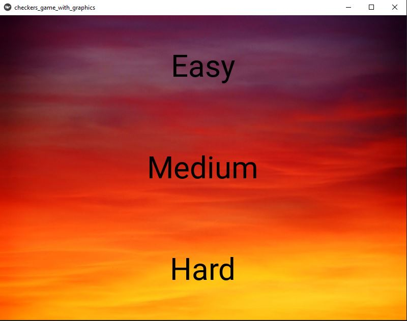
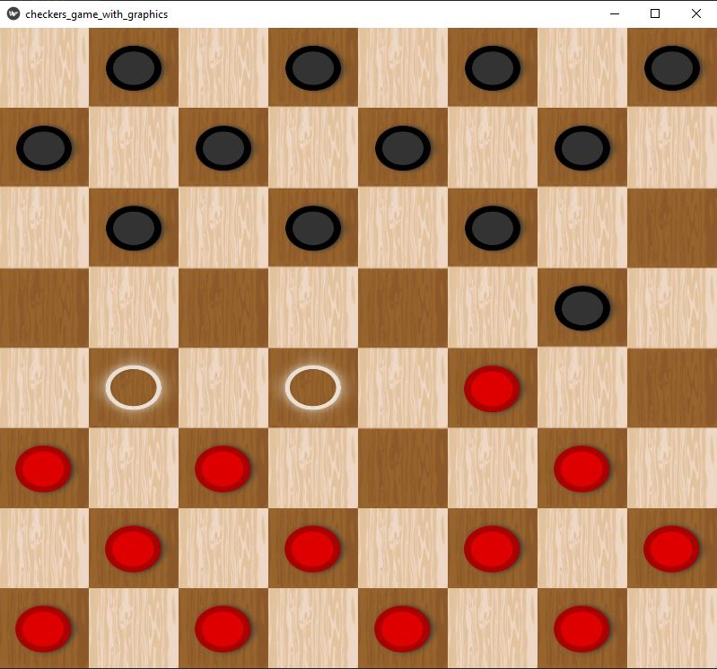
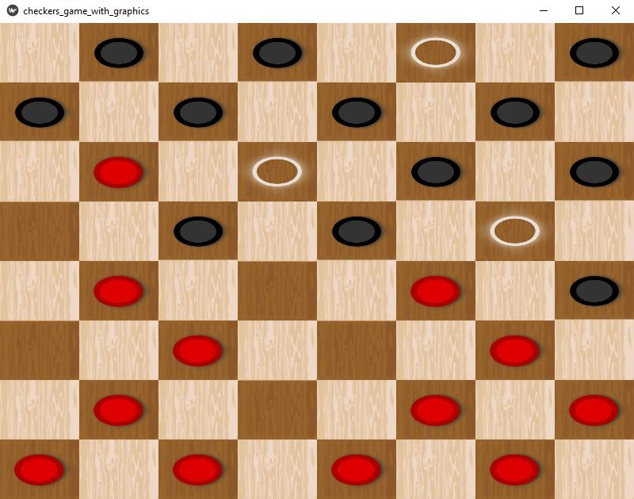
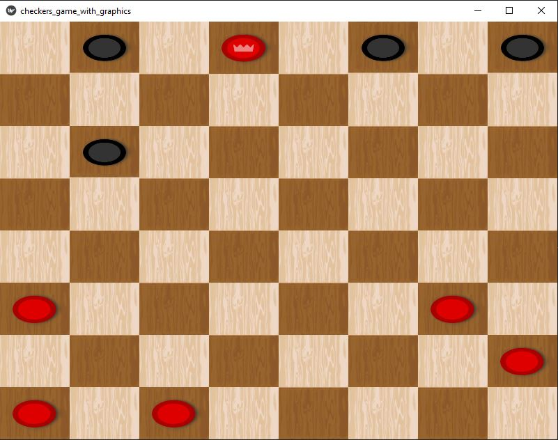

# Checkers Game


## Description
This program plays a game of checkers against a user, using neural network, RL, minimax algorithm and kivy based GUI.
The file "build_dict.py" builds a dictionary of 
game boards by playing 200,000 games of checkers. The boards are saved in a string format that uses less
memory and makes the search in the dictionary faster. Each board is given a score based
on RL method of operant conditioning - positive strengthening of the score if the game was a win and negative
strengthening if the game was a loss. I wanted to build a "smart" dictionary with successful moves and not just 
random moves because this will make it easier later for the neural network to learn based on this dictionary.
Therefore, the dictionary was created with two players that play based on minimax algorithm.
The minimax algorithm explores a game tree recursively, alternately maximizing and minimizing players.
By assigning values and backtracking, it identifies the optimal move, assuming optimal play from both sides.
In order to avoid a situation in which all the games I run would be the same,
I created the dictionary with players that have
0.3 probability to play a random move and 0.7 probability to play with minimax in each turn they play. 
After I created the dictionary and saved it as "checkers_test_dict1.json", I created a neural 
network with keras library and trained the network in "train_network.py" file with the dictionary.
Then, I used Weights & Biases platform in "network.py" file in order to improve the performance of the network.
The final network's weights are saved under the file "test_model1.h5".
The file "game_with_network.py" enables to play the checkers game with kivy based GUI on 3 different levels:
against random player, against the network I created and against the minimax algorithm.

## Usage
1. Run "game_with_network.py" file.

2. You will see the instructions screen for the game, after you read them press continue.
<p align="center">
  
</p>

3. Pick the level you want to play against.

<p align="center">
  
</p>

4. You will see the checkers board game, click on the tool you want to move in this turn, then
you will see all the moves you can do with this tool. Click the one you want to do in order 
to move the tool. If you pressed on a tool but want to move another tool instead, just press the tool 
you want to move and you will see all the move options for this tool.


<p align="center">
  
</p>

5. After your turn, wait until the computer plays his turn and then continue playing.

<p align="center">
  
</p>

6. The winner of the game is the first player who managed to get a queen.

<p align="center">
  
</p>


## Requirements
1. 
```bash
pip install -r requirments.txt
```

